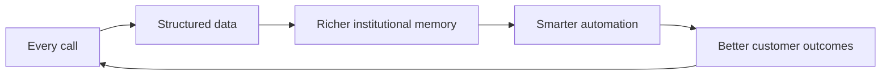

<style>
:root {
  --brand-primary: #3D3DAA;
  --brand-accent: #E8485A;
  --brand-gold: #F5C842;
  --brand-teal: #00B4A0;
  --brand-bg: #F7F7FC;
}
.slidev-layout { background: var(--brand-bg); }
h1 { color: var(--brand-primary); font-weight: 800; }
h2 { color: var(--brand-primary); }
.accent { color: var(--brand-accent); font-weight: 700; }
.gold { color: #b8860b; font-weight: 800; }
.teal { color: var(--brand-teal); font-weight: 800; }
.kpi { font-size: 2.45rem; font-weight: 800; color: var(--brand-primary); }
.kpi-small { font-size: 1.65rem; font-weight: 800; color: var(--brand-primary); }
.kpi-label { color: #555; font-size: .88rem; }
.note { color: #666; font-size: .82rem; }
</style>

# D10 Group
## Sondos · Siyadah

**We turn every business phone call into compounding institutional memory.**

<span class="accent">Voice is the wedge. Memory is the moat.</span>

Seed Round · 2026 · Riyadh

---
layout: center
---

# The answer, first

D10 is building the **automated operating system for Arabic-first businesses**.

- **Sondos** — Arabic AI voice agents that create immediate revenue proof.
- **Siyadah** — plain-Arabic automation and memory layer that compounds every customer interaction.
- Every Sondos call feeds Siyadah's memory → <span class="accent">data compounds, workflows improve, switching costs rise.</span>

Raising **$1M Seed** to convert early revenue + enterprise pipeline into a repeatable Saudi AI operating system.

---

# Why this matters

Saudi businesses lose money between three gaps:

<div class="grid grid-cols-3 gap-6 pt-6">
<div>

### 📞 Calls
Missed calls, weak follow-up, no-show leakage, and manual collection.
</div>
<div>

### 🧠 Memory
Customer knowledge lives in people, WhatsApp chats, and scattered sheets.
</div>
<div>

### ⚙️ Execution
Existing tools require engineers, English-first workflows, and fragmented integrations.
</div>
</div>

<br>

**D10 closes the gap from call → memory → automated action.**

---

# Why now

1. **Arabic voice quality is crossing usability** — real Saudi conversations can now be handled by AI agents.
2. **Saudi companies are under productivity pressure** — automation is becoming a CFO decision, not a tech experiment.
3. **Data and compliance matter locally** — Arabic, local operations, and Saudi business context matter.
4. **Agentic operating systems are becoming a category** — but the Arabic-first enterprise layer is still open.

---

# Sondos — the voice wedge

- Inbound and outbound Arabic/Saudi voice AI.
- Post-call actions: update sheets/CRM, trigger WhatsApp, notify team, and create structured records.
- Best-fit early sectors: healthcare, real estate, charities, collections, HR/services, insurance, and software operations.
- Sold on immediate ROI: answered calls, recovered missed opportunities, and structured follow-up.

<span class="accent">Sondos creates revenue today and data for Siyadah tomorrow.</span>

---

# Siyadah — the memory and execution layer

```text
Employee types:  "كل عميل ما رد على مكالمتين، أرسل له واتساب وسجّله في الشيت"
Siyadah:         understands intent → builds workflow → executes → remembers
Result:          automation without engineers
```

Siyadah turns scattered company activity into a memory layer that can act.

**The strategic role:** every call, customer, and workflow becomes part of the company brain.

---
layout: center
class: text-center
---

# LIVE PROOF

### Demo path

Call → structured data → workflow trigger → dashboard evidence

<span class="accent">Use recorded backup if live demo conditions are not stable.</span>

---

# The flywheel — why value compounds



Tools get replaced. **Memory does not migrate easily.**

---

# Current traction — revenue baseline

<div class="grid grid-cols-4 gap-4 pt-8">
<div><div class="kpi">29.0K</div><div class="kpi-label">SAR current MRR</div></div>
<div><div class="kpi">347.6K</div><div class="kpi-label">SAR implied ARR</div></div>
<div><div class="kpi gold">87%</div><div class="kpi-label">raw unit gross margin</div></div>
<div><div class="kpi">4</div><div class="kpi-label">active revenue customers</div></div>
</div>

<br>

**Current MRR includes تقدير correctly as an annual contract:** 12,900 SAR/year = 1,075 SAR monthly equivalent.

<span class="note">All metrics remain subject to evidence pack: contracts, invoices, and collection proof.</span>

---

# Current customer base

| Customer | Sector | MRR treatment | Monthly equivalent |
|---|---|---|---:|
| الاناة الطبية | Healthcare | Current MRR | 17,391.5 SAR |
| جمعية زمزم | Charity | Current MRR | 5,400 SAR |
| جمعية إعادة الحياة | Healthcare | Current MRR | 5,100 SAR |
| شركة تقدير | Real estate | Annual contract | 1,075 SAR |

**Current MRR:** 28,966.5 SAR  
**Current ARR:** 347,598 SAR

---

# Enterprise pipeline — upside not counted in MRR

<div class="grid grid-cols-3 gap-6 pt-8">
<div><div class="kpi">57K</div><div class="kpi-label">SAR/month potential</div></div>
<div><div class="kpi">684K</div><div class="kpi-label">SAR/year potential</div></div>
<div><div class="kpi-small">SAICO</div><div class="kpi-label">enterprise pipeline</div></div>
</div>

<br>

SAICO is shown as **enterprise pipeline only**. It is not counted in current MRR or ARR until revenue activation.

<span class="accent">One enterprise account can exceed the current full MRR base.</span>

---

# Historical GTM evidence

Old Sondos dashboard evidence shows early market experimentation:

| Metric | Historical dashboard value | Use |
|---|---:|---|
| Campaigns | 25 | GTM activity |
| Meetings | 25 | Sales motion |
| Trials | 16 | Trial demand |
| Customers | 1 | Historical conversion |
| Revenue | 995 SAR | Historical dashboard revenue |

Channels included email campaigns, WhatsApp AI campaigns, and call AI campaigns.

<span class="note">This is pipeline evidence, not current MRR.</span>

---

# Business model & unit economics

- Revenue model: voice AI packages + usage economics + workflow expansion.
- Raw unit gross margin: **87%**.
- Minute economics: cost/minute around **0.36 SAR**, resale around **2.5–3.0 SAR**.
- Expansion path: Sondos voice data → Siyadah workflows → memory and automation attach.

<span class="accent">Voice generates the first ROI. Memory creates the long-term moat.</span>

---

# Market wedge — bottom-up from where we already see demand

We are not starting with a theoretical TAM. We start from sectors already touched by revenue, trials, and pipeline:

| Sector | Why it hurts |
|---|---|
| Healthcare | missed calls, appointments, no-shows, follow-up |
| Real estate | lead follow-up, valuation, scheduling, repeated inquiries |
| Charities | donor/customer calls, campaign follow-up, operations |
| Insurance | high-volume service and enterprise workflows |
| Collections / HR / services | repetitive outreach and structured follow-up |

---

# Competition — they sell tools; we accumulate memory

| Competitor type | Their edge | Why we win |
|---|---|---|
| Global voice AI | maturity and capital | Saudi dialects, Arabic-first UX, local workflows |
| Call centers | incumbency | 24/7 operation, cost efficiency, structured data exhaust |
| Automation tools | breadth | Arabic commands, voice data wedge, business-user workflow creation |
| Future local clones | speed to copy features | data history, memory moat, execution velocity |

---

# Team and operating discipline

Founder: **Abdulrahman Fahad Alkhanfari**

D10 runs with investor-grade operating discipline:

- Truth packs before claims.
- Evidence gates before investor use.
- Technical proof before storytelling.
- Sondos is the revenue wedge; Siyadah is the scalable operating system.

<span class="accent">We are building the company brain while using the company as the first lab.</span>

---
layout: center
---

# The Ask

## $1M Seed

**Use of funds:**

- 50% product and engineering
- 30% growth and enterprise sales
- 20% operations, compliance, and data-room readiness

**18-month milestones:**

1. Convert enterprise pipeline into recurring revenue.
2. Prove repeatable sales motion in 2–3 verticals.
3. Launch Siyadah as the memory/execution layer attached to Sondos data.

<br>

<span class="accent">Abdulrahman Fahad Alkhanfari · ranaan23@gmail.com</span>
