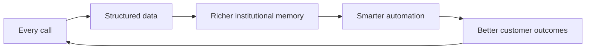

<style>
:root {
  --brand-primary: #3D3DAA;
  --brand-accent: #E8485A;
  --brand-gold: #F5C842;
  --brand-teal: #00B4A0;
  --brand-bg: #F7F7FC;
}
.slidev-layout { background: var(--brand-bg); }
h1 { color: var(--brand-primary); font-weight: 800; }
h2 { color: var(--brand-primary); }
.accent { color: var(--brand-accent); font-weight: 700; }
.gold { color: #b8860b; font-weight: 800; }
.kpi { font-size: 2.6rem; font-weight: 800; color: var(--brand-primary); }
.kpi-label { color: #555; font-size: .9rem; }
</style>

# D10 Group
## Sondos · Siyadah

**We turn every business phone call into compounding institutional memory.**
<span class="accent">Voice is the wedge. Memory is the moat.</span>

Seed Round · 2026 · Riyadh

---
layout: center
---

# The answer, first

D10 is building the **automated operating system for Saudi businesses**.

- **Sondos** — Arabic-first AI voice agents → immediate ROI, immediate revenue
- **Siyadah** — plain-Arabic automation orchestrator → the memory & execution layer
- Every Sondos call feeds Siyadah's memory → <span class="accent">value compounds with usage</span>

Raising **$1,000,000** to reach **280 customers · 9M SAR ARR · Siyadah commercial launch** in 18 months.

---

# Saudi businesses bleed on three fronts

<div class="grid grid-cols-3 gap-6 pt-6">
<div>

### 📞 Calls
Missed calls, no-shows, cold leads — human call teams are costly and sleep at night.
<div class="kpi">X</div>
<div class="kpi-label">تكلفة 5-10 موظفي متابعة: 300-600K ريال/سنة — والمعرفة ترحل معهم</div>
</div>
<div>

### 🧠 Memory
What a customer said last month leaves with the employee who heard it.
</div>
<div>

### ⚙️ Automation
Global tools require engineers SMBs don't have — and speak English first.
</div>
</div>

---

# Why now — four waves, one moment

1. **Regulatory** — PDPL & data-localization make the compliant local player *structurally* favored
2. **Economic** — Vision 2030 productivity push + rising labor cost = automation is a CFO decision
3. **Technical** — Arabic voice AI just crossed natural-conversation quality; MCP makes agent↔system wiring cheap
4. **Category** — "Company Brain / Agentic OS" is forming globally — <span class="accent">no one is building it Arabic-first</span>

---

# Sondos — the agent that acts during the call

- Inbound & outbound, real Saudi dialects
- **Mid-Call Tools**: reads the CRM, checks balances, books in Cal.com — *while talking*
- Post-call: updates HubSpot/GoHighLevel/Sheets, fires WhatsApp — drag-&-drop, no code
- Integrations: SIP · WhatsApp · Slack · email · any API · MCP

> Sold on immediate ROI: answered calls, recovered no-shows, collected payments.

---

# Siyadah — automation in plain Arabic

```text
Employee types:  "كل عميل ما رد على مكالمتين، أرسل له عرض واتساب وسجّله في الشيت"
Orchestrator:    parses intent → builds the workflow → runs it on the engine
Result:          automation without engineers
```

The strategic role: **the memory and execution layer every call feeds.**

---
layout: center
class: text-center
---

# LIVE PROOF

### A real call happens here — watch the agent book, update, and trigger automation
<span class="accent">rehearsed live demo · recorded backup ready</span>

---

# The flywheel — why value compounds



Tools get replaced. **Memory doesn't migrate.**

---

---

# The Dream — Conditional on This Round

**كل شركة عربية لها جهاز عصبي رقمي.** يرى · يفهم · يقرر · ينفذ · يقيس — بتدخل بشري <5%

| اليوم (مُثبت) | بهذه الجولة — 18 شهراً | Series A وما بعد |
|---|---|---|
| الحلقة تعمل بالإنتاج: 18 موظفاً رقمياً، 19 تكاملاً | 280 عميلاً · 9M ريال ARR · **سيادة GA** فوق قاعدة سندس | قائد فئة Agentic OS العربي · توسع خليجي |
| سندس تموّل التعلم: 14 عميلاً يدفعون | تشغيل **Data Flywheel**: كل مكالمة → ذاكرة → خندق أعمق | الذاكرة المتراكمة = بنية تحتية لا تُنسخ |

> وصلنا للإثبات بـ 120K ريال ملائكة. هذا ما يفعله $1M.

---

# Proof — مُثبت بسجلات الإنتاج

<div class="grid grid-cols-4 gap-4 pt-8">
<div><div class="kpi">~18K SAR</div><div class="kpi-label">MRR</div></div>
<div><div class="kpi gold">X%</div><div class="kpi-label">MoM growth</div></div>
<div><div class="kpi">14</div><div class="kpi-label">paying customers</div></div>
<div><div class="kpi">X%</div><div class="kpi-label">retention</div></div>
</div>

<br>

> سندس اليوم: 14 عميلاً مدفوعاً · MRR ~18K ريال · الحمادي وSMC وسبل على اللوحة\nالحمادي: ضياع مكالمات بـ150-200K ريال/شهر → رد فوري 100%\nسيادة: E2E مُثبت بالسجلات — 18 موظفاً رقمياً · 19 تكاملاً

---

# Business model & unit economics

- Pricing: model — subscription / per-minute / seats · ACV X
- Gross margin **X%** after voice/LLM per-minute cost of X
- CAC X · payback X months
- Expansion: customers add Siyadah workflows on the same data → NRR X%

---

# Market — bottom-up, not 1%-of-a-billboard

| | |
|---|---|
| Target establishments (top 3 sectors, KSA) | N |
| × ACV (actual) | X |
| = Obtainable KSA market | **SOM** |
| GCC expansion path | X |

---

# Competition — they sell tools; we accumulate memory

| Competitor | Their edge | Why we win |
|---|---|---|
| Global voice-AI | maturity, capital | لهجات سعودية · PDPL/توطين · تكاملات محلية · حاجز صوت سندس 2-3 سنوات |
| Call centers | incumbency | cost/call · 24/7 · structured data exhaust |
| Global automation | breadth | Arabic-first UX · voice data wedge |
| Future local clones | parity | data head-start · memory moat · ship velocity |

---

# Team — and we are our own first customer

**عبدالرحمن الخنفري — CEO:** سنوات في إدارة مراكز الاتصال السعودية؛ يبني الحل للمشكلة التي عاشها وخسر بسببها صفقات. **عبدالملك المنيف — شريك تقني:** بنى الـ Orchestrator والمعمارية multi-tenant المثبتة بالسجلات.

The company itself runs on agent reviews (CEO review, QA, ship gates) —
**15 بدوام كامل يشحنون كفريق ضعف حجمهم**: الشركة تُدار بوكلائها (CEO-Review, QA, Ship) — والريبو مفتوح للفحص.

---
layout: center
---

# The Ask

## $1,000,000 Seed
**Use of funds:** 50% team & engineering · 30% growth & marketing · 20% product

**18-month milestones → Series-A ready:**
1. 9M SAR ARR
2. 280 paying customers
3. Siyadah commercial GA + voice-memory attach on Sondos base

<br>
<span class="accent">عبدالرحمن الخنفري · البريد الرسمي — ليس d10ksa3@gmail: احجز abdulrahman@d10.sa</span>
