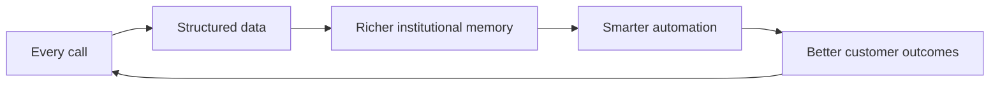

<style>
:root {
  --brand-primary: #3D3DAA;
  --brand-accent: #E8485A;
  --brand-gold: #F5C842;
  --brand-teal: #00B4A0;
  --brand-bg: #F7F7FC;
}
.slidev-layout { background: var(--brand-bg); }
h1 { color: var(--brand-primary); font-weight: 800; }
h2 { color: var(--brand-primary); }
.accent { color: var(--brand-accent); font-weight: 700; }
.gold { color: #b8860b; font-weight: 800; }
.teal { color: var(--brand-teal); font-weight: 800; }
.kpi { font-size: 2.45rem; font-weight: 800; color: var(--brand-primary); }
.kpi-small { font-size: 1.6rem; font-weight: 800; color: var(--brand-primary); }
.kpi-label { color: #555; font-size: .88rem; }
.note { color: #666; font-size: .82rem; }
.box { background: #fff; border-radius: 18px; padding: 22px; box-shadow: 0 10px 35px rgba(0,0,0,.06); }
</style>

# D10 Group
## Sondos · Siyadah

**Infrastructure for the Autonomous Enterprise.**

<span class="accent">Voice is the wedge. Memory is the moat.</span>

Seed Round · 2026 · Riyadh

---
layout: center
---

# The answer, first

D10 is building the **automated operating system for Arabic-first businesses**.

- **Sondos** — Arabic AI voice employees that create immediate revenue proof.
- **Siyadah** — plain-Arabic automation and memory layer that compounds customer interactions.
- Every Sondos call can feed Siyadah's memory → <span class="accent">data compounds, workflows improve, switching costs rise.</span>

Raising **$1M Seed**. Ownership percentage and valuation are intentionally left for negotiation.

<span class="note">All operating, customer, revenue, margin, retention, and growth metrics are frozen until founder-verified from billing, contracts, and logs.</span>

---

# Data status — investor safety gate

This deck is currently in **metrics-free narrative mode**.

| Metric category | Status | Required source |
|---|---|---|
| MRR / ARR | TO VERIFY | invoices + collections |
| Paying customers | TO VERIFY | active contracts + paid invoices |
| ARPU / ACV | TO VERIFY | billing export |
| Gross margin | TO VERIFY | voice/LLM cost + revenue |
| Burn / Runway | TO VERIFY | bank + payroll + obligations |
| Pipeline | TO VERIFY | signed documents + stage evidence |

<span class="accent">Rule: no number becomes investor-facing until it has evidence.</span>

---

# The problem — the operating gap

Saudi service businesses do not just miss calls. They lose operating memory.

<div class="grid grid-cols-3 gap-5 pt-6">
<div class="box">

### 📞 Lost demand
Missed calls, slow follow-up, no-shows, repeated questions, and weak collection loops.
</div>
<div class="box">

### 🧠 Lost memory
Customer context lives inside employees, WhatsApp chats, and scattered sheets — then disappears.
</div>
<div class="box">

### ⚙️ Lost execution
Global tools require engineers, English workflows, and manual system-to-system coordination.
</div>
</div>

<br>

**The core gap:** humans work in limited windows. Digital employees can operate continuously, remember every interaction, and trigger the next action automatically.

---

# Why now — the window is open

1. **Technology** — Arabic voice AI and LLM orchestration are becoming usable enough for real operations.
2. **Economics** — labor pressure turns missed follow-up and call inefficiency into CFO-level pain.
3. **Policy** — Vision 2030, data governance, and local AI infrastructure favor Saudi-first operators.
4. **Category** — the world is moving from SaaS tools to agentic operating systems.

<span class="accent">The Arabic-first autonomous enterprise category is not locked yet.</span>

---

# Our belief

<div class="grid grid-cols-3 gap-5 pt-6">
<div class="box">

### Belief I
Operational intelligence is the next infrastructure layer — like SaaS was in 2010.
</div>
<div class="box">

### Belief II
Arabic markets can leapfrog because labor pressure, digitization, and AI readiness are colliding.
</div>
<div class="box">

### Belief III
The winner combines voice + memory + execution. **Sondos + Siyadah = defensible wedge.**
</div>
</div>

---

# Sondos — the voice wedge

- Arabic/Saudi voice AI for inbound and outbound conversations.
- Post-call actions: update sheets/CRM, trigger WhatsApp, notify team, and create structured records.
- Best-fit early sectors: healthcare, real estate, charities, collections, HR/services, insurance, and software operations.
- Sold on immediate ROI: answered calls, recovered missed opportunities, and structured follow-up.

<span class="accent">Sondos creates revenue today and data for Siyadah tomorrow.</span>

---

# Siyadah — the memory and execution layer

```text
Employee types:  "كل عميل ما رد على مكالمتين، أرسل له واتساب وسجّله في الشيت"
Siyadah:         understands intent → builds workflow → executes → remembers
Result:          automation without engineers
```

Siyadah turns scattered company activity into a memory layer that can act.

**The strategic role:** every call, customer, and workflow becomes part of the company brain.

---
layout: center
class: text-center
---

# LIVE PROOF

### Demo path

Call → structured data → workflow trigger → dashboard evidence

<span class="accent">Use recorded backup if live demo conditions are not stable.</span>

---

# The flywheel — why value compounds



Tools get replaced. **Memory does not migrate easily.**

---

# Traction — frozen pending evidence

The company has early commercial and technical signals, but exact numbers are not shown until verified.

<div class="grid grid-cols-4 gap-4 pt-8">
<div><div class="kpi">VERIFY</div><div class="kpi-label">MRR</div></div>
<div><div class="kpi">VERIFY</div><div class="kpi-label">ARR</div></div>
<div><div class="kpi">VERIFY</div><div class="kpi-label">gross margin</div></div>
<div><div class="kpi">VERIFY</div><div class="kpi-label">paying customers</div></div>
</div>

<br>

<span class="note">Insert only founder-confirmed metrics backed by invoices, collections, contracts, and logs.</span>

---

# Customer base — frozen pending billing review

| Customer / segment | Status | Evidence required |
|---|---|---|
| Active paid accounts | TO VERIFY | contract + paid invoice |
| Annual contracts | TO VERIFY | contract + monthly-equivalent treatment |
| Enterprise pipeline | TO VERIFY | stage, documents, expected start date |
| Churned / trial accounts | TO VERIFY | do not count in MRR |

<span class="accent">Rule: trial, expired, unpaid, or pipeline accounts are not counted as current MRR.</span>

---

# Business model & unit economics

- Revenue model: voice AI packages + usage economics + workflow expansion.
- Pricing: TO VERIFY
- Cost per minute / LLM cost: TO VERIFY
- Gross margin: TO VERIFY
- Expansion path: Sondos voice data → Siyadah workflows → memory and automation attach.

<span class="accent">Voice generates the first ROI. Memory creates the long-term moat.</span>

---

# Market wedge — bottom-up from verified segments

We are not starting with a theoretical TAM. We start from sectors already touched by revenue, trials, or pipeline — after verification.

| Sector | Why it hurts | Evidence status |
|---|---|---|
| Healthcare | missed calls, appointments, no-shows, follow-up | TO VERIFY |
| Real estate | lead follow-up, valuation, scheduling, repeated inquiries | TO VERIFY |
| Charities | donor/customer calls, campaign follow-up, operations | TO VERIFY |
| Insurance | high-volume service and enterprise workflows | TO VERIFY |
| Collections / HR / services | repetitive outreach and structured follow-up | TO VERIFY |

---

# Competition — they sell tools; we accumulate memory

| Competitor type | Their edge | Why we can win |
|---|---|---|
| Global voice AI | maturity and capital | Saudi dialects, Arabic-first UX, local workflows |
| Call centers | incumbency | 24/7 operation, cost efficiency, structured data exhaust |
| Automation tools | breadth | Arabic commands, voice data wedge, business-user workflow creation |
| Future local clones | speed to copy features | data history, memory moat, execution velocity |

---

# Team and operating discipline

Founder: **Abdulrahman Fahad Alkhanfari**

D10 runs with investor-grade operating discipline:

- Truth packs before claims.
- Evidence gates before investor use.
- Technical proof before storytelling.
- Sondos is the revenue wedge; Siyadah is the scalable operating system.

<span class="accent">We are building the company brain while using the company as the first lab.</span>

---
layout: center
---

# The Ask

## $1M Seed

**Use of funds:**

- 50% product and engineering
- 30% growth and enterprise sales
- 20% operations, compliance, and data-room readiness

**18-month milestones:**

1. Convert verified enterprise pipeline into recurring revenue.
2. Prove repeatable sales motion in 2–3 verticals.
3. Launch Siyadah as the memory/execution layer attached to Sondos data.

<br>

<span class="accent">Abdulrahman Fahad Alkhanfari · ranaan23@gmail.com</span>
